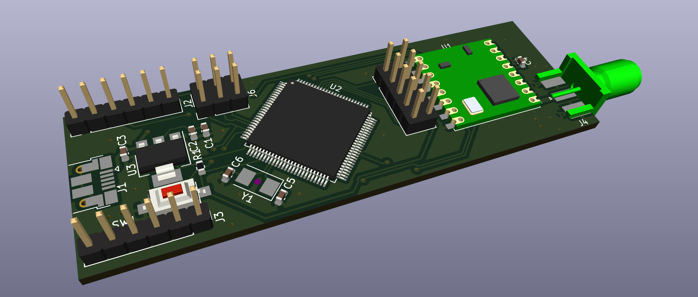
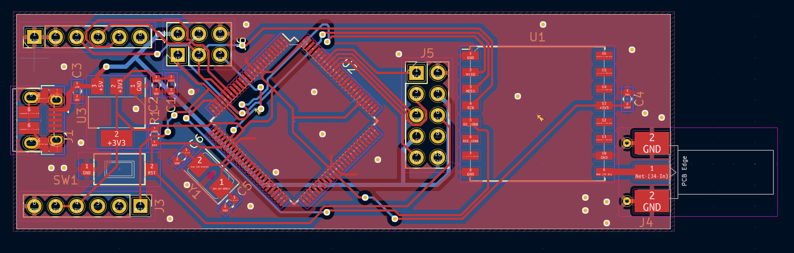
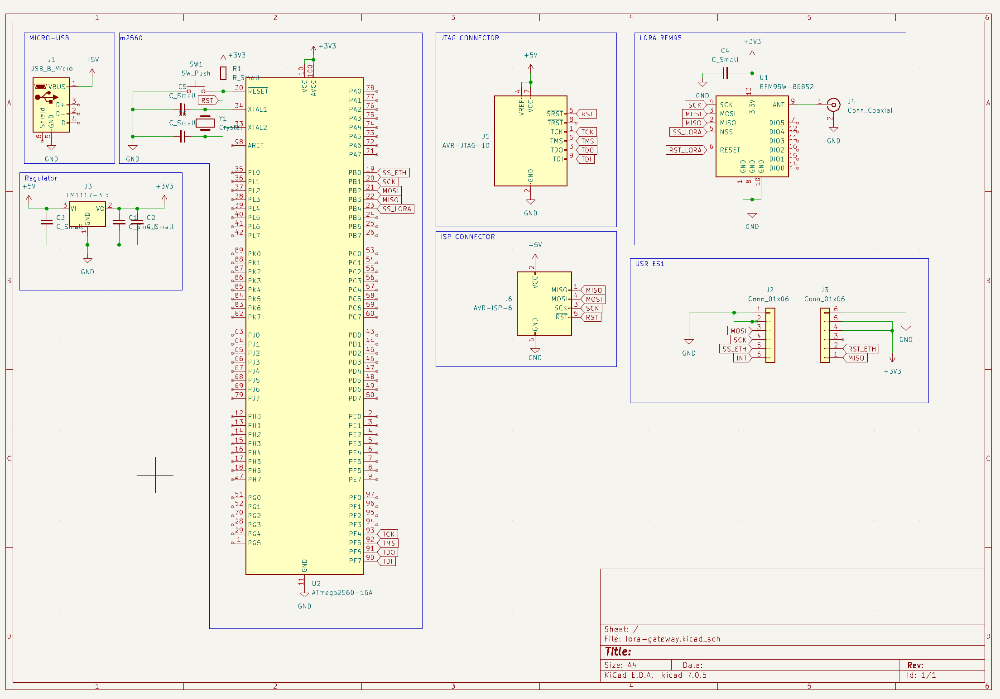

# Lora gateway with ethernet

## Project for make simple and reliable Lora gateway with AVR atmega2560 and ESR-US1 w5500 ethernet

#### 3d view

#### pcb view

#### schematic view

### TODO

- [ ] Add RTC
- [ ] Add temperature sensor